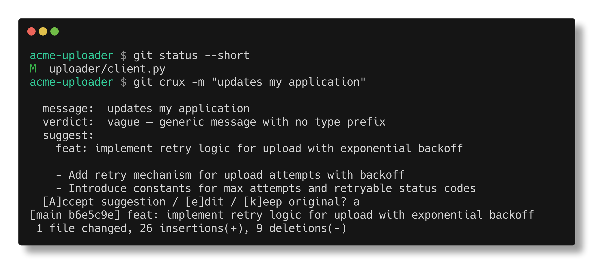

# git-crux

[](https://github.com/jonhadfield/git-crux/actions/workflows/ci.yml)
[](https://github.com/jonhadfield/git-crux/releases/latest)
[](LICENSE)

**Your commit message, checked against what you actually changed.**

git-crux reads the staged diff, judges the message you wrote against it, and —
when the message is vague, incomplete, or plain wrong — suggests a sharper one.
It sharpens *your* stated intent rather than generating from scratch, so the
message still says what you meant.



Run it as `git crux -m "..."`, or install the hook and let plain `git commit`
handle itself. It **never blocks a commit**: if the model is unreachable or
confused, your commit goes through untouched.

- **Conventional Commits by default** — `feat:`, `fix:`, `chore:`, … inferred
  from the diff; `GIT_CRUX_STYLE=plain` for a plain imperative subject instead
- **Any OpenAI-compatible endpoint** — OpenAI's `gpt-4o-mini` out of the box,
  or keep diffs on your machine with [LM Studio](https://lmstudio.ai), Ollama
  (`:11434/v1`), or llama.cpp via `GIT_CRUX_BASE_URL`
- **Handles big diffs** — larger changes are split, summarized, then judged as a
  whole, so no file is silently dropped
- **Measured, not vibes** — a labelled evaluation set scores the prompt, so a
  change to it can be checked instead of eyeballed

Note: with the OpenAI default, each reviewed diff is sent to OpenAI.

## Why "crux"

It gets to the crux of the change: does your message actually describe what you
did?

## Install

With [Homebrew](https://brew.sh):

```sh
brew install jonhadfield/tap/git-crux
```

Or, on macOS, download the signed installer — `git-crux_<version>_macos.pkg` on
the [latest release](https://github.com/jonhadfield/git-crux/releases/latest) —
and open it. It puts `git-crux` in `/usr/local/bin`. The package is notarized
with a stapled ticket, so it installs with no Gatekeeper warning; a bare binary
from one of the tarballs is quarantined by the browser and refused instead.

Or with Go 1.22 or later:

```sh
go install github.com/jonhadfield/git-crux@latest
```

Or from a checkout:

```sh
go build -o git-crux .
```

Because git resolves `git crux` to a `git-crux` binary on `PATH`, you get the
`git crux` subcommand for free.

Then point it at a model. With `OPENAI_API_KEY` set you are already done. To
keep diffs on your machine instead, start a local server — with LM Studio, run
its server (default port 1234) and load a model — and set `GIT_CRUX_BASE_URL`
(see Configuration). **Model choice matters a lot** (see Status): a 14B-class
instruct model such as `microsoft/phi-4` is the realistic local minimum.

## Use

**As an explicit command** (no setup beyond install) — the screenshot above
shows a full run:

```sh
git add .
git crux -m "updates my application"
```

**As a hook**, so plain `git commit` is handled automatically:

```sh
git crux init          # installs .git/hooks/prepare-commit-msg
git commit -m "fix"    # git-crux steps in only if the message is off-point
git commit             # no -m: git-crux pre-fills the editor with a generated message
```

To cover **every** repository at once, install globally via git's `core.hooksPath`:

```sh
git crux init --global   # installs into ~/.config/git/hooks and points core.hooksPath there
```

Note: `core.hooksPath` replaces per-repo `.git/hooks`, so any existing repo-local
hooks won't run unless moved into the shared directory.

With no `-m`, the generated message lands in your `$EDITOR` — edit and save to
accept, or empty the buffer to abort. (Merge, squash, and amend commits are left
untouched.)

**Dry run** — print the verdict as JSON without committing (handy for testing):

```sh
git crux -m "fix stuff" -dry-run
```

## Configuration

All optional; the defaults target OpenAI's `gpt-4o-mini`. **If no API key is
found** (neither `GIT_CRUX_API_KEY` nor `OPENAI_API_KEY`), git-crux falls back to
a local server (`http://localhost:1234/v1`, model `microsoft/phi-4`) instead of
erroring — so it works out of the box whether or not you have a key.

| Env var              | Default                      | Meaning                                   |
| -------------------- | ---------------------------- | ----------------------------------------- |
| `GIT_CRUX_BASE_URL`  | `https://api.openai.com/v1`  | OpenAI-compatible base URL. Set to e.g. `http://localhost:1234/v1` to run local. |
| `GIT_CRUX_MODEL`     | `gpt-4o-mini`                | Model id to request.                      |
| `GIT_CRUX_API_KEY`   | _(falls back to `OPENAI_API_KEY`)_ | Bearer token for hosted APIs; ignored by local servers.|
| `GIT_CRUX_SKIP`      | _(unset)_                    | Set to any value to disable evaluation.   |
| `GIT_CRUX_STYLE`     | `conventional`               | Message style: `conventional` (Conventional Commits) or `plain` (imperative subject). |
| `GIT_CRUX_CONTEXT`   | _(auto from model)_          | Model context window in tokens; sizes the diff sent for review. |
| `GIT_CRUX_MAX_DIFF`  | _(auto from context)_        | Hard cap on diff bytes sent; overrides the context-derived budget. |

## Flags

| Flag        | Default            | Meaning                                       |
| ----------- | ------------------ | --------------------------------------------- |
| `-m`        | —                  | Commit message. Omit to have git-crux generate one. |
| `-model`    | _(resolved at runtime)_ | Model to use. Defaults to `GIT_CRUX_MODEL`, else the active server profile (`gpt-4o-mini` for OpenAI, `microsoft/phi-4` local). |
| `-style`    | `conventional`     | Message style: `conventional` or `plain` (overrides `GIT_CRUX_STYLE`). |
| `-no-ai`    | `false`            | Skip evaluation, commit as-is.                |
| `-dry-run`  | `false`            | Print the verdict JSON and exit.              |

## Message style

By default git-crux follows the
[Conventional Commits](https://www.conventionalcommits.org) standard: every
suggested subject begins with a type prefix the model infers from the diff —
`feat:` for a new capability, `fix:` for a correction, `perf:`, `refactor:`,
`docs:`, `test:`, `build:`, `ci:`, `style:`, `chore:`, or `revert:`. A breaking
change is marked with `!` (e.g. `feat!:`). Under this style a message that
describes the change well but **lacks a valid prefix** is still flagged, so a
plain `fix login bug` is sharpened to `fix: correct login validation`.

Prefer terse, prefix-free subjects? Switch to the plain imperative style:

```sh
git crux -m "fix login" -style plain        # one-off
export GIT_CRUX_STYLE=plain                 # for the session / in your shell rc
```

Type selection is left to the model from the diff; there's no flag to pin a type
(write the prefix yourself with `-m` if you want to override it).

## Behaviour & guardrails

- **Fails open.** If the model server is unreachable, errors, or returns
  unparseable output, the commit proceeds untouched. git-crux never blocks a
  commit.
- **Quiet when the message is good.** It only prompts on a `vague`,
  `incomplete`, or `wrong` verdict.
- **Chunks large diffs.** A diff that fits the model's budget is reviewed in one
  call. A larger one is split into parts, each summarized separately, then judged
  as a whole from those summaries — so no file is dropped. Very large diffs are
  capped at a fixed number of parts (the rest is covered by the file map).
- **Skips non-interactive contexts.** No terminal, or `CI` set → does nothing.
- **Skips merge / squash / amend** commits.
- **Bypass** any time with `GIT_CRUX_SKIP=1` or `git commit --no-verify`.
- The hook **chains** to a pre-existing `prepare-commit-msg` hook (preserved as
  `prepare-commit-msg.local`).

## Status

v1.0 — works end to end against OpenAI and OpenAI-compatible local servers.
Follows Conventional Commits by default, installs globally via `core.hooksPath`,
chunks large diffs, shows a spinner while the model runs, and cancels cleanly on
Ctrl-C.

**Model quality is the gating factor**, especially for *generating* messages
(bare `git crux` / empty `git commit`), which needs a capable model with enough
context: `gpt-4o-mini` is reliable, while small local models (e.g. an 8K-context
`microsoft/phi-4`) tend to parrot the prompt or truncate large diffs. Verdicts
are requested at `temperature 0` for determinism. The prompt is tuned against the
curated evaluation set (see above), not a broad benchmark, so expect rough edges
on unusual diffs.

## Evaluation set

Because the verdict is the product of a *prompt*, changing the prompt can quietly
regress it. A curated set of labelled cases lives in `testdata/eval/` — each is a
commit message, a staged diff, and the expected verdict — so you can measure
before and after a prompt change instead of eyeballing it.

```sh
make eval                              # needs model env (OPENAI_API_KEY, or GIT_CRUX_BASE_URL)
GIT_CRUX_EVAL_MIN=0.8 make eval        # also fail if verdict accuracy drops below 80%
```

The runner prints a per-case PASS/FAIL table and a confusion matrix. The corpus
itself is validity-checked on every `go test` run (no model needed), so a
malformed or mislabelled case fails CI. Add a case by dropping a new directory
into `testdata/eval/` with `message.txt`, `diff.patch`, and `want.json`.

The labels encode git-crux's *intended* behaviour; a model that disagrees on a
borderline case is exactly the signal the set exists to surface.

## Build from source

```sh
make build     # -> ./git-crux
make install   # go install
make test      # go test ./...
```

## License

[MIT](LICENSE) © 2026 Jon Hadfield
